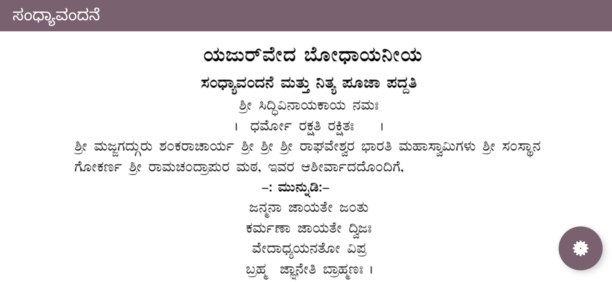

# YajurVedaApp
An application for vedic practitioners. Created this to help me learn kotlin with Design patterns (MVP), Dependency Injection (Dagger2), Database(RoomDB), Firebase, ML kit and more.

Information about the app
-----

```
* Make an application to help users read the documents from pdf.
* Text data to be stored in firebase and to be accessed from database
* Use Kotlin, MVP, Dagger
* Make an outline for the user to access his pages easily
* Store data in firebase and take from there while checking for 3 cases:
  * If network not available use from roomDB
  * If network available check the version from firebase and if version is changed download the data or else use the roomDB data
  * Also keep a hardcopy inside the app for the first time user, if he is not connected to network ask him to connect and     download if he disagrees to download show the hardcoded, if he agrees, clear the old data and store the new data from firebase.
* Give  font and size, brightness, darkmode, remainder, about, share and rate options.
* Reminder for everyday / Parental control.
* Resume reading dialog
* ViewPager on top to traverse easily
```

## Screenshots:

<div align="center">
 
 
 
</div>

License
=======

    Copyright 2020 Kashyap Bhat

    Licensed under the Apache License, Version 2.0 (the "License");
    you may not use this file except in compliance with the License.
    You may obtain a copy of the License at

       http://www.apache.org/licenses/LICENSE-2.0

    Unless required by applicable law or agreed to in writing, software
    distributed under the License is distributed on an "AS IS" BASIS,
    WITHOUT WARRANTIES OR CONDITIONS OF ANY KIND, either express or implied.
    See the License for the specific language governing permissions and
    limitations under the License.

