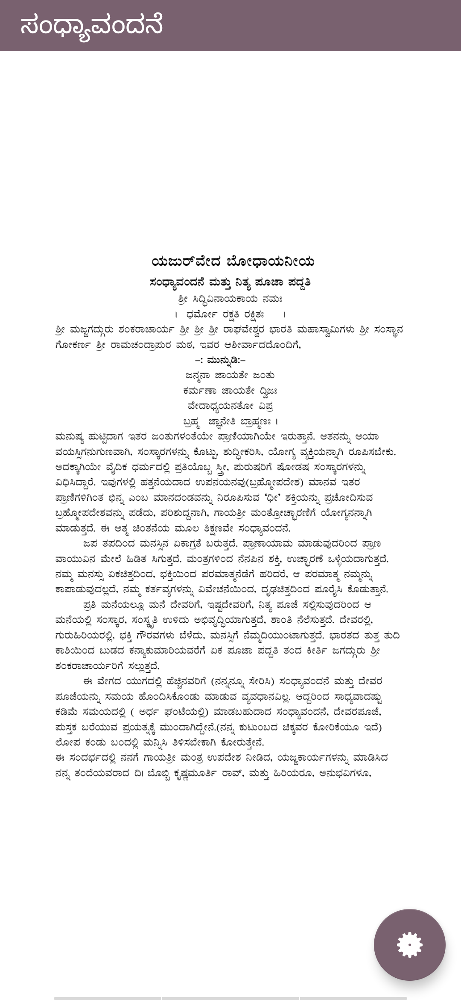
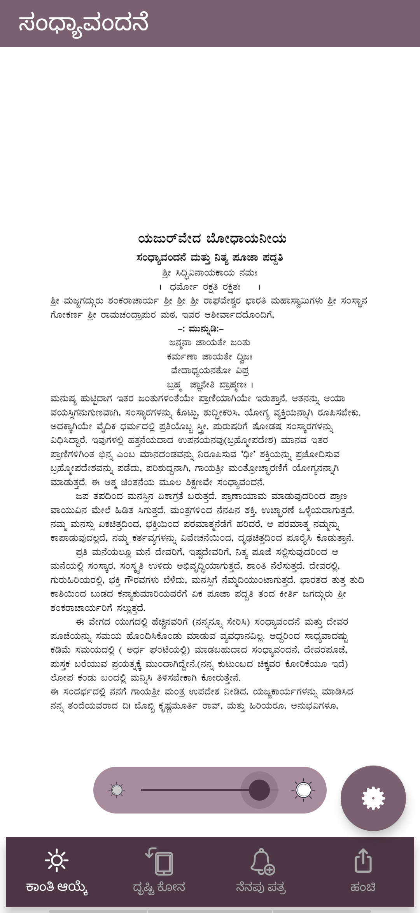
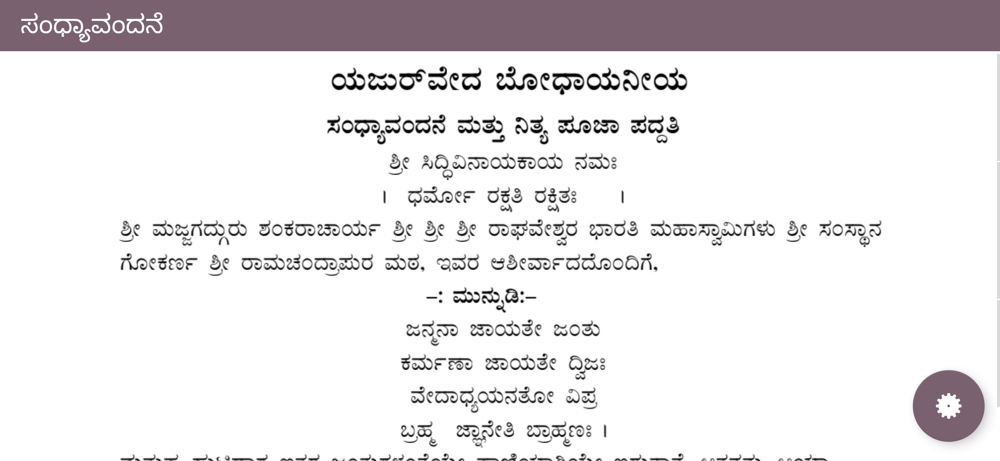
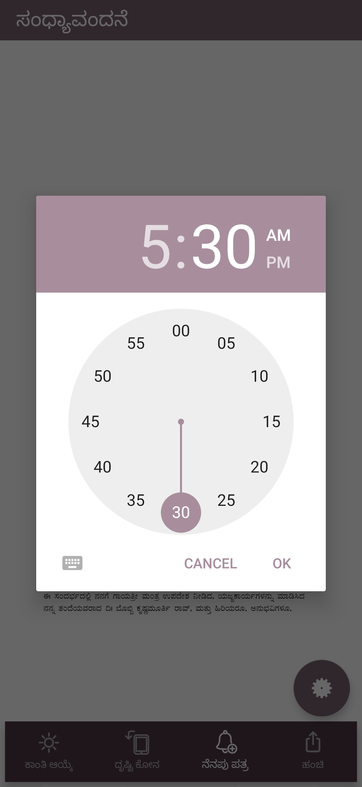
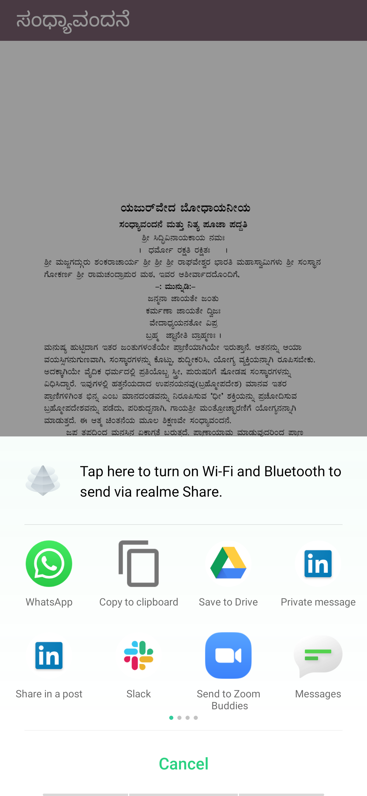

# YajurVedaApp
For learning kotlin with MVP, Dependency Injection, Database, Permissions handling etc

## OVERVIEW:
An application for vedic practitioners.

## GOALS:

* Make an application to help users read the documents from pdf.
* Text data to be stored in firebase and to be accessed from database
* Use Kotlin, MVP, Dagger
* Make an outline for the user to access his pages easily
* Store data in firebase and take from there while checking for 3 cases:
  * If network not available use from roomDB
  * If network available check the version from firebase and if version is changed download the data or else use the roomDB data
  * Also keep a hardcopy inside the app for the first time user, if he is not connected to network ask him to connect and     download if he disagrees to download show the hardcoded, if he agrees, clear the old data and store the new data from firebase.
* Give  font and size, brightness, darkmode, remainder, about, share and rate options.
* Reminder for everyday / Parental control.
* Resume reading dialog
* ViewPager on top to traverse easily

 
 
 
 
 

